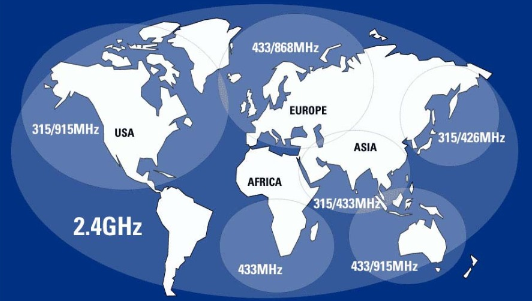
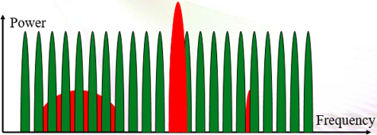
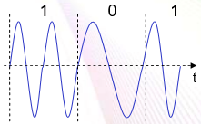

# 深入BLE协议栈 —— 物理层

## 1. 简介

物理层（Physical Layer）是BLE协议栈最底层，它负责最原始的比特0和比特1的收发通信。从无线通信理论角度看，BLE芯片的核心是一个BLE信号的收发机。BLE协议栈的物理层部分，详细规定了接收机与发射机各自的参数和特性。

BLE芯片的物理层实现，将直接决定该芯片的通信速率、通信距离、发射功率、接受灵敏度、射频功耗等最为基础的参数性能。

了解物理层对于理解BLE芯片的使用，把握BLE应用的范围，以及设计BLE产品的测试方案，都能带来帮助。

## 2. 频段和跳频

在这个星球上，无线通信的频段并不可以自由使用，不同地区开辟了一些免费的频段，只要产品满足当地无线电规范要求，即可免授权进行使用。下图展示了全球免费频段的分布（[链接](http://predictabledesigns.com/most-important-decision-when-creating-wireless-product/)）：

图中2.4GHz的频段很强势，覆盖了整个地图，是专为工业（**I**ndustrial）、科学（**S**cientific）和医学（**M**edical）三个机构使用，称为ISM频段，全球范围都可以免费使用该频段。

BLE即工作在2.4GHz频段。

2.4GHz频段有明显的优缺点，优点是免费、技术成熟，缺点是频段拥挤、传播特性差、遇水衰减。目前除了蓝牙信号外，WIFI、ZigBee、无线键盘、无线玩具甚至微波炉都工作在这个频段。当一个空间内同时运行着WIFI信号、微波炉和无线设备的时候，空间内的频带占用情况如下图（[链接](http://www.ti.com/lit/ml/slap127/slap127.pdf)）：

其中绿色的脉冲为BLE信号，红色信号分别是WIFI、微波炉和无线设备，它们对BLE而言就是干扰噪声。

BLE工作在2.400GHz - 2.480GHz频率区间，并将这个区间均匀分为40个频道，相邻频道间隔2MHz，各个频道的频率和分布如下图：

BLE使用跳频技术（Frequency Hopping）来解决频段拥挤问题。在一个通信任务结束会更新信道信息，下一次通信任务将会发生在另一个信道上，整个通信过程在不同的信道之间进行跳转。

一个简单的跳频算法是：$F_{n+1} = (F_n + hop) \space \% \space 37$

hop参数为物理层自己设定的跳频参数。

实际中使用的是自适应跳频（Adaptive Frequency Hopping）算法，也称伪随机跳频算法。

自适应跳频的工作机制是，如果某个信道上产生较高的误码率，则标记为“坏”信道。工作时准备一个37比特的信道记录表Channel Map，每个比特位记录一个信道的“好”“坏”状态，如果设1则表示该信道是”坏“信道，暂时不能使用，如果设0则表示尚未使用。除了这张表，还需要一张表记录”好“信道Used Map。Used的含义是，如果一个信道曾经使用过（used），那么就认为它是在短期内是”好“的。Channel Map中的”坏“信道会被映射到Used Map中，这样整个Channel Map中的信道都变得”可用“。

利用这个重映射过的Channel Map，再结合上面的简单跳频算法，给出一个合理的hop值和初始频率，即可进行跳频。

## 3. 调制

### 3.1 调制方案

BLE协议栈物理层定义了两种调制方案。一种方案使用高斯频移键控GFSK（Gauss frequency Shift Keying），这种方案具有1MSym/s的符号速率（Symbol Rate）。另一种调制方案是与第一种相似（Similar），但是具有2MSym/s的符号速率。

第一种方案又分成两种物理层实现方式：

- LE 1M。这种方式的比特率（Bit Rate）为1Mb/s。它是BLE v4系列版本中所采用的调制方式。
- LE Coded。这种方式对数据帧进行编码，接收端具有较强的自校正能力，在相同的误码率条件下，能够显著提升通信过程中的误码重传次数，进而提高通信速率。 传输过程中，数据帧的Access Address, Coding Indicator和TERM1字段使用125kb/s的比特率，而其他payload信息的比特率为125kb/s或者500kb/s，因此可以简单的理解这种方式的比特率有125kb/s和500kb/s两种。

LE 1M是BLE协议强制要求实现的物理层实现方式，而LE Coded则是可选的方式。

这两种实现方式，虽然比特率不同，但是符号速率是相同的，都是1MSym/s。

符号速率中的“符号”是指单次采样所得到的信息，这个信息可能包含多个比特，也可能多次采样才能确定一个比特。举个例子，对于电压幅度调制系统，使用+5V表示11， +2V表示10， -2V表示01， -5V表示00，那么采样一次电压可以获得两个比特，此时比特率是符号速率的两倍。假如采取一定的编码机制，用八个连续高电平表示比特1，即采样八次均是1才确定收到比特1，此时比特速率是符号速率的1/8。

第二种方案对应的物理层实现方式是：

- LE 2M。这种方式的码率为2Mb/s，仅支持无编码（Uncoded）工作方式。这种方案也是可选的，意味着两个BLE的终端产品在通信前，需要先确认双方都支持这种调制方案，才能够以2Mb/s的速率进行通信。

为了描述方便，官方文档使用LE 1M PHY、LE Coded PHY、LE 2M PHY来表示以上三种不同的物理层实现方式：

| 物理层      | 调制方案       | 编码方案（Access Header） | 编码方案（Payload） | Data Rate       |
| -------- | ---------- | ------------------- | ------------- | --------------- |
| LE 1M    | 1Msym/s 方案 | 无编码                 | 无编码           | 1Mb/s           |
| LE 2M    | 2Msym/s 方案 | 无编码                 | 无编码           | 2Mb/s           |
| LE Coded | 1Msym/s 方案 | 编码S=8               | 编码S=8;S=2     | 125kb/s;500kb/s |

表中的S=8表示每个比特等于8个符号。

### 3.2 GFSK

频率调制就是将数据加载到高频载波上，数据的变化反映为调制波频率的疏密变化。如下图所示：

数字化的信号仅有0、1变化，在调制时，可以定义载波频率正向偏移为数字1，负向偏移为数字0。这种调制方式称为“频移键控（FSK）”。数字信号的0、1变换时，会产生高频噪声，引入高斯滤波器能够延展0-1之间的转换时间，进而降低噪声。这种做法称为“高斯频移键控（GFSK）”。

GFSK技术成熟，BLE选择GFSK的一个重要原因是看中了它的实现简单。

BLE协议规定，中心频率正向偏移大于等于185kHz视为数字比特1， 负向偏移大于等于185kHz视为数字比特0。假如选择2402MHz作为中心频率，比特1的频率应为2402.185MHz， 比特0的频率应为2401.815MHz。

## 4. 发射机

### 4.1 发射机框图

图中信号从左向右流动，基带信号经过GFSK调制分成同相和正交两路信号，再依次经过DA转换和低通滤波器，然后利用频率合成器进行频率上转换，再将两个信号分量合成后通过PA放大将信号推送到天线上。

I/Q相位分量并行操作用以抑制镜像频率，PLL驱动的频率合成器可以产生稳定和精确的频率信号，其他的滤波和变换则比较容易理解。

这篇论文（[链接](http://www.elektrorevue.cz/clanky/04003/english.htm#Kapitola 3)）介绍了蓝牙收发机的一些具体内容，传播比较广，对于这块感兴趣的可以参考一下。

### 4.2 发射机参数

#### （1）发射功率

| 最小输出功率          | 最大输出功率         |
| --------------- | -------------- |
| 0.01mW (-20dBm) | 100mW (+20dBm) |

最大功率+20dBm是BLE 5版本更新的，在之前BLE协议规定中，最大输出功率为+10dBm。

最大、最小输出功率仅为上下限，表征BLE设备的射频输出能力，并非正常工作时候的运行功率。当两个设备首次连接时，应该避免使用最大输出功率，因为假如对端设备距离非常近，+20dBm的发射功率可能导致对端接收机瞬间饱和，而造成通信失败。

BLE协议按照输出功率将BLE设备分成如下几类：

| 功率等级 | 最大输出功率         | 最小输出功率          |
| ---- | -------------- | --------------- |
| 1    | 100mW (+20dBm) | 10mW (+10dBm)   |
| 1.5  | 10mW (+10dBm)  | 0.01mW (-20dBm) |
| 2    | 2.5mW (+4dBm)  | 0.01mW (-20dBm) |
| 3    | 1mW (0dBm)     | 0.01mW (-20dBm) |

第一等级的设备值得注意，如果该设备能够输出+20dBm的功率，那么它的最小功率就要设定在+10dBm以上。

#### （2）调制参数

调制方式：GFSK （假设只考虑BR模式）

带宽时间积BT=0.5

调制因子=0.45-0.55

有效频率偏移为±185kHz

时钟精度±50ppm

这些涉及到比较专业的射频知识，这里不做展开。

#### （3）杂散波

使用某个频率发射随机数据，在相邻±2MHz的频点位置，杂散波功率应小于-20dBm，在相邻±3MHz以上的频点位置，杂散波功率应小于-30dBm。

#### （4）射频容限

中心频率偏移小于等于±150kHz。

最大频率漂移小于等于±50kHz。

最大频率漂移速率小于等于400Hz/us。

由于射频频率稳定性跟晶振有直接关联，所以频偏参数事实上限定了外部射频晶振的误差值。

举个例子，使用16MHz的外部石英晶振为射频提供时钟，16MHz扩频到2.4GHz需要放大150倍，其误差也将一同放大150倍。假如它的误差为±50ppm，即16MHz × ±50ppm = ±800Hz，放大150倍后变成±120kHz，这几乎达到±150kHz的频偏限制，因此许多芯片都限制射频晶振的误差要小于50ppm。

无责任推测，假如使用24MHz的晶振，扩频倍数降低，那么相同的误差等级的晶振，将获得更优良的射频频偏参数。不过事实上，16MHz的晶体比较便宜和常用。

其他的频率漂移参数，也都跟晶振参数有直接关联，在选择晶振时候需要做相应的考虑。

## 5. 接收机

### 5.1 接收机框图

接收过程几乎是发射过程的逆过程，但接收机相比于发射机而言，更加复杂，相关研究文献也更加丰富。

这篇项目报告（[链接](http://www2.imm.dtu.dk/pubdb/views/edoc_download.php/5479/pdf/imm5479.pdf)）详细论述了蓝牙接收机的解调器，值得参考。截取其中的接收机架构框图如下：

蓝牙信号进入到芯片内部，首先经过低噪声放大器（LNA），仍然是分成I/Q两个相位分量，再通过带通滤波器，VGA（Variable Gain Amplifier）可以按需进行放大，最后转成数字信号传入处理器中，这里框图省略了GFSK的解调过程，它位于AD转换器之后。

### 5.2 接收机参数

#### （1）误码率

BLE通信时，因为外部干扰导致某些比特发送失败，进而重新传输。误码率BER（Bit Error Rate）表征这种比特传输失败的几率。

如果误码率过高，会显著影响通信速率。BLE协议要求传输小包时，误码率要低于0.1%。这也是BLE设备RF性能测试的一个标准。

进一步，BLE协议规定了传输不同长度数据包时候的误码率的阈值：

| 最大支持的Payload长度 | BER阈值（%） |
| -------------- | -------- |
| ≤ 37           | 0.1      |
| 38 ~ 63        | 0.064    |
| 64 ~ 127       | 0.034    |
| ≥ 128          | 0.017    |

#### （2）接收灵敏度

BLE协议对于Uncoded的物理层和Coded的物理层给出了不同的接收灵敏度要求：

| 物理层类型                        | 接收灵敏度（dBm） |
| ---------------------------- | ---------- |
| LE Uncoded PHY               | ≤ -70      |
| LE Coded PHY with S=2 coding | ≤ -75      |
| LE Coded PHY with S=8 coding | ≤ -82      |

今天市面上的BLE芯片，支持LE Uncoded的物理层都宣称达到-90dBm甚至更低的接收灵敏度，某些BLE 5的芯片其接收灵敏度可达-97dBm。

在理想的条件下，假设发射机输出功率是0dBm，接收机灵敏度是-90dBm。BLE信号经过一段路径到达接收机，功率衰减到-90dBm，这段路径上的路径损耗就等于90dB。如果输出功率是20dBm，当衰减至-90dBm时，路径损耗就是110dB。

路径损耗与通信距离直接相关：

$path \space loss = 40 + 25 \times log (distance)$

做成表格将更加直观：

| 路径损耗(path loss) | 通信距离(distance) |
| --------------- | -------------- |
| 50dB            | 2.5m           |
| 60dB            | 6.3m           |
| 70dB            | 16m            |
| 80dB            | 40m            |
| 90dB            | 100m           |
| 100dB           | 250m           |
| 110dB           | 630m           |

注意70dB一行，当发射功率为默认的0dBm，接收灵敏度为协议规定最小值的-70dBm，那么可实现的最大距离就是10米多一点。这也就是许多资料上说BLE是一个10米范围的通信技术。考虑到事实上各厂家BLE芯片的接收灵敏度都在-90dBm左右，通信距离应该远大于10米。

而BLE 5的推出，极大的提升了通信距离的潜力，各个厂家势必会努力提升通信距离，最近Nordic和TI针对自家BLE 5芯片做了实际测试，在最优环境下通信距离高达1000米以上，令人震惊。

路径损耗是链路预算（Link Budge）的主要部分，部分芯片厂家会在手册中给出链路预算值，可以作为该芯片通信距离最大值的一个相关参数。

#### （3） 抗干扰能力

一个接收机的同频道噪声抵抗能力为21dB，相邻的1MHz频点处的噪声抵抗能力为15dB。

1M PHY与2M PHY的要求略有不同。

对带外（2.4GHz范围外的频段）噪声，也应有响应的抵抗能力。

#### （4）最大有效功率

接收机至少在-10dBm下能够正常工作，即保证BER优于0.1%。

## 6. 收发机

前面介绍了发射机和接收机，在实际的BLE芯片中，接收机和发射机是放在同一个电路中，称为收发机（Transceiver），下图是一个2.4GHz产品框图，有实际的参考价值（[链接](http://www.semtech.com/images/datasheet/rf_design_guidelines_semtech.pdf)）：

## 7. 小结

物理层的核心是围绕着2.4GHz频率信号的收发而展开的，理解这些内容，对于理解后续章节尤其是链路层会产生帮助。BLE产品开发末期，会进行射频认证和测试，这些工作都需要对物理层的收发机参数有充分的认识。

（完）